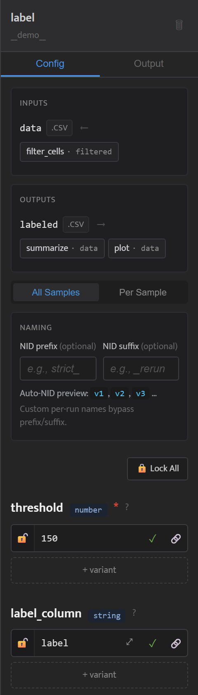
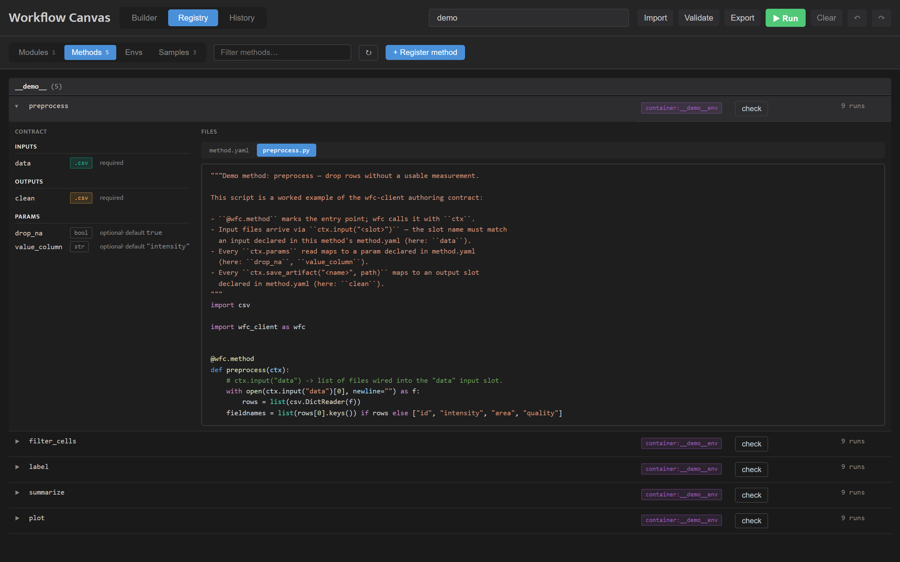
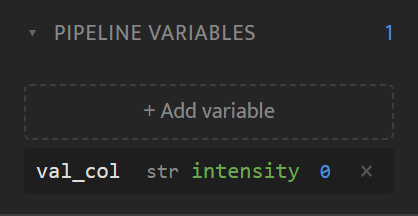
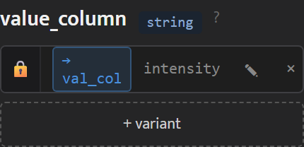
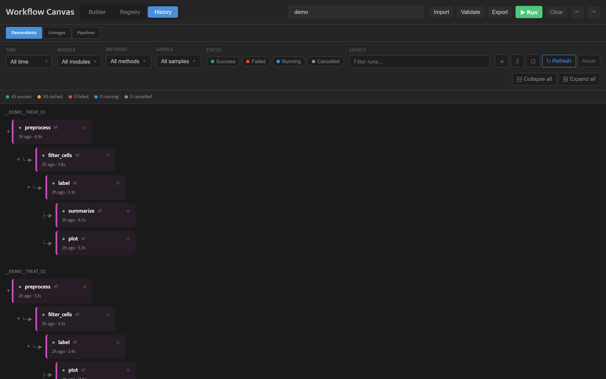
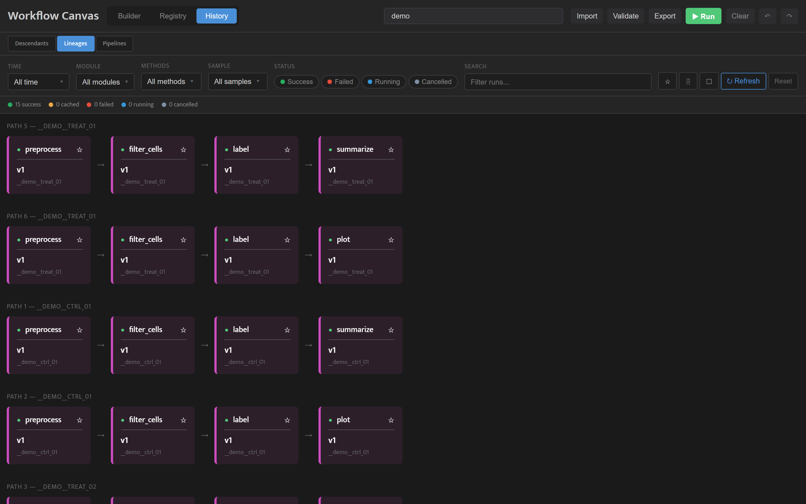
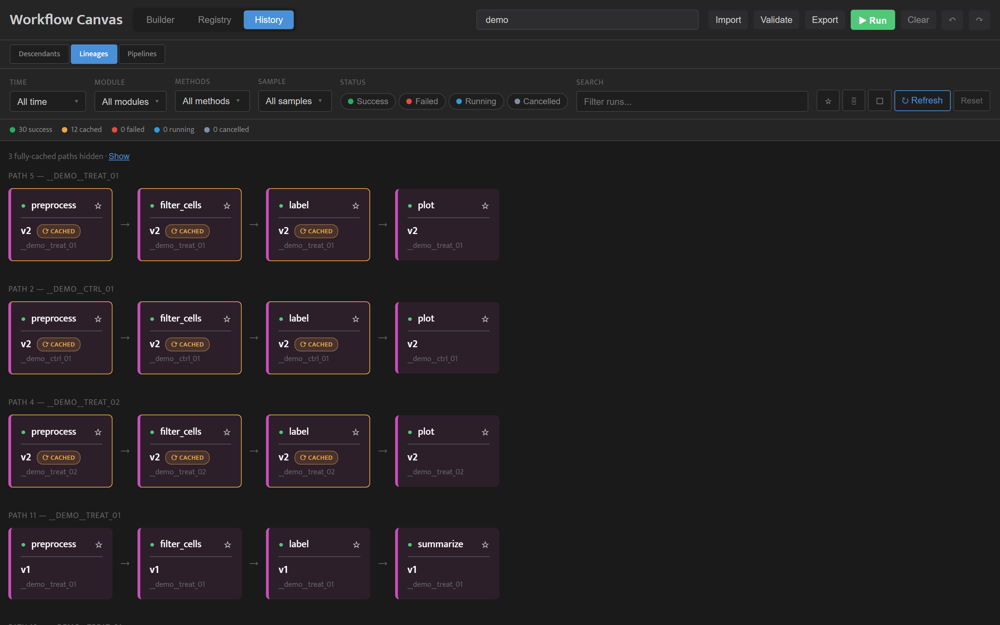
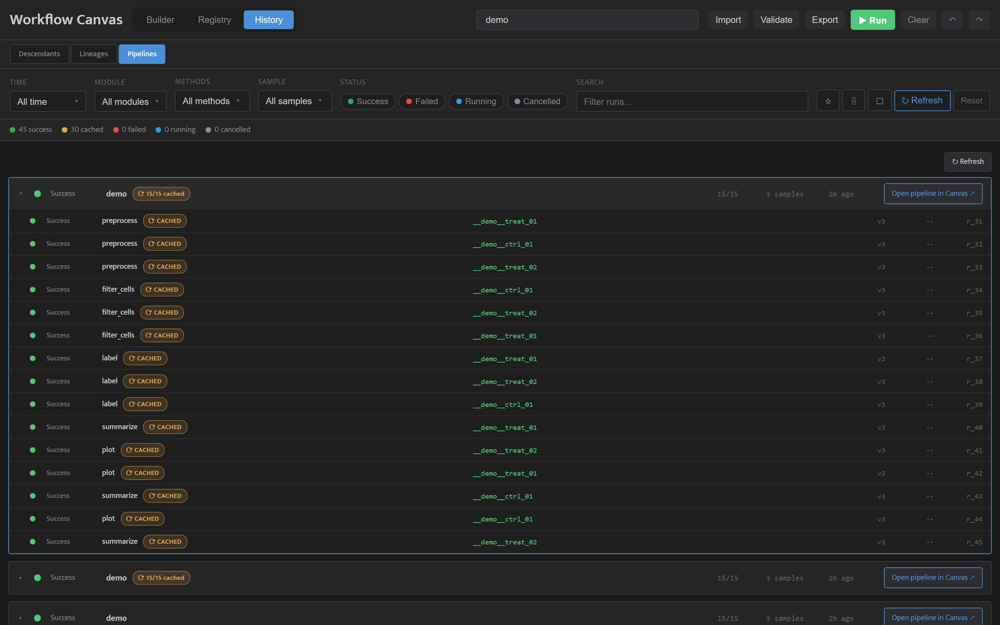

<!-- generated from pm_mvp::docs.consumer.how-to.canvas @ 840a3171daf0; do not edit -->

# Canvas Visual Builder

## Overview

Canvas is a browser-based visual interface for building and monitoring pipelines. Launch it with `wfc canvas` (default port 8500).

Canvas has three views:

- **Builder** -- a drag-and-drop node-graph editor for creating pipelines visually. Wire method nodes together, configure parameters, validate the graph, and run the pipeline -- all from the browser.
- **History** -- a run history viewer for inspecting past pipeline executions. Browse runs, view lineage chains, inspect metadata/params/metrics, and download artifacts.
- **Registry** -- a browser for everything registered in the project: modules, methods, samples, and environments, with on-demand method validation.

## System Nodes

Pipeline inputs are provided through **system nodes** -- special non-method nodes that serve as data sources for the DAG. System nodes are the only valid root nodes in a pipeline; every method node must have at least one incoming edge.

Two system node types exist:

- **Input Selector** -- a sample picker that selects registered samples from the project database as pipeline inputs. Queries `GET /api/wfc/samples` to populate the picker.
- **Run Reference** -- a previous-run output picker that selects outputs from completed pipeline runs as static inputs to downstream steps. Queries `GET /api/wfc/completed-runs` to populate the picker.

The system-node-only-roots constraint is enforced during both validation (`POST /api/workflow/validate`) and pipeline loading (`load_pipeline`). A method node with no upstream connection is rejected as an invalid root.

## Builder Basics

The Builder view is a Svelte Flow node-graph editor with three panels: a sidebar palette on the left, the canvas in the center, and an inspector panel on the right.

**Node palette:** The left sidebar lists all registered methods grouped by module, with a search bar at the top. System nodes (Input Selector, Run Reference) appear above a divider at the top of the palette. Each method shows slot badges and `MULTI` indicators for fan-in inputs.

**Drag-and-drop:** Drag a method from the palette onto the canvas to create a node. Nodes display typed input slots (left side) and output slots (right side). Each slot's `type` is the declared file extension (dotted, e.g. `.csv`, `.h5ad`) or the directory marker `dir` / `directory`, and the slot is colour-coded from that extension. Common extensions get a stable curated colour; any other extension gets a colour derived deterministically from the extension string, so distinct extensions stay visually distinct. A slot with no declared type renders grey.

| Extension | Colour | Hex |
|---|---|---|
| `.csv`, `.tsv` | orange | `#F39C12` |
| `.parquet` | purple | `#9B59B6` |
| `.json` | blue | `#4A90D9` |
| `.png`, `.jpg`, `.jpeg`, `.svg` | red | `#E74C3C` |
| `.pkl` | amber | `#E9A847` |
| `.h5ad` | green | `#50C878` |
| `.txt` | grey | `#95A5A6` |
| `dir`, `directory` | teal | `#1ABC9C` |

Any extension not in this list is given a generated colour from its name; an untyped slot is grey.

**Connections:** Click an output slot and drag to an input slot. Type compatibility is advisory — slot types are shown by colour, but the editor does not block a mismatched connection; graph correctness (unknown methods, unconnected required inputs, method nodes used as roots) is checked server-side when you Validate. Fan-in inputs (`multiple: true`) accept multiple incoming connections.

**Param editing:** Select a node to open the inspector panel. Method nodes show form controls: text fields for strings, number spinners for int/float, toggles for booleans, and a JSON editor for list/dict params. System nodes show their respective pickers (sample picker or run picker).

**Import / Export:** Import a pipeline JSON file to recreate nodes and connections automatically. Export the current graph as pipeline JSON (`{nodes, links, samples, param_sets, variables}`). An export with no variable-bound parameter rows runs directly with `wfc run-pipeline`. When rows are bound to pipeline variables, the export is the pre-substitution form — bound values are written as `{"$var": ...}` references, and only the Canvas server resolves those at submission. `wfc run-pipeline` does not resolve them; run variable-bound pipelines from the Canvas. The `param_sets` block carries parameter sweeps / per-sample overrides; the `variables` block carries pipeline variables (see Pipeline Variables below).

**Validate and Run:** Click Validate to check the graph against registered methods via `POST /api/workflow/validate`. If valid, click Run to execute. Before running, give the pipeline a name in the toolbar's name field. The name becomes the card title in the History tab's Pipelines view, so two submissions of the same pipeline shape stay tellable apart. A polling loop provides live per-node status feedback during execution. Undo/redo is available via Ctrl+Z / Ctrl+Y (50-entry snapshot stack).

## Registry View

The Registry view is the third top-level canvas view, alongside the Builder and History. It lets you browse everything registered in the project -- modules, methods, samples, and environments -- without dropping to the CLI.

**Modules:** Lists every registered module with its output-contract chips and an `N methods →` link that jumps to that module's methods.

**Methods:** Lists registered methods. Expand a row to see a three-column contract grid (inputs / outputs / params) and a syntax-highlighted file viewer showing every file in the method directory. Each method has a **check** button that runs on-demand validation against the current code and reports pass or fail inline, surfacing the error output when a method fails to validate.

**Samples:** Lists registered samples with their state -- pushed to the archive or local-only -- and how many runs have used each.

**Envs:** Lists registered environments. Expand a pixi or conda env to see its **Packages** panel: the installed `name==version` list, tagged by source (conda / pixi / pip). Bring-your-own and not-yet-captured envs show a backend-specific empty state instead.

These are read-and-browse surfaces; to register from the browser instead of the CLI, see [Registering Modules, Methods, and Samples](../how-to/registration.md), and for how environments are built and referenced, see [Registering an Environment](../tutorials/registering-an-environment.md).

## Pipeline Variables

Pipeline Variables let you name a value once and bind it to multiple parameter rows across the pipeline — eliminating the need to retype shared column names (e.g. `label_column`, `condition_column`) in every node inspector. Variables are a Track 2 feature introduced in ADR-017.

**Creating a variable:**

The Pipeline Variables panel is a collapsible section inside the Builder tab (below the Samples panel). Click `+ Add variable` to open an inline-add row. Fill in:
- **Name** — a short identifier (e.g. `shared_label_col`)
- **Type** — `str`, `int`, `float`, `bool`, `list`, or `dict`
- **Value** — the literal value appropriate to the chosen type

Confirm to add the variable to the panel table. Variables can be edited inline in the table row. Deleting a variable that is bound to any rows shows a confirmation prompt.

**Binding a param row to a variable:**

Open the inspector for any method node. Each parameter row shows a chain icon (bind button). Click the chain icon to open the bind picker — a dropdown that lists existing pipeline variables. Select a variable to bind the row; the row displays a `→ varname` chip and the input field is replaced with the resolved value (greyed). Type-mismatched variables appear greyed and unselectable. If no variables exist yet, the picker shows "No pipeline variables yet — create one in the Pipeline Variables panel."

**Rules:**
- Variables are created **only** in the Pipeline Variables panel (not inline from the bind picker).
- A row that is in the `bound` state cannot also have sweep variants or per-sample overrides (the UI prevents it).
- Clicking into a bound row's input area breaks the binding in one gesture, restoring the last-known literal value as the starting draft.

**Server-side substitution:**

When you submit a pipeline run, the server calls `resolve_variables` before enrichment. `{"$var": "name"}` refs are replaced with their literal values from the `variables` block. The pre-substitution form is saved as `pipeline.editable.json` so History reload can rehydrate variables and chips.

**History round-trip:**

When you open a past pipeline from the History tab via "Open pipeline in Canvas," the canvas tries to fetch `pipeline.editable.json` first (falling back to `pipeline.json` for legacy runs). If the editable sidecar is present, `parsePipelineJSON` repopulates the `pipelineVariables` store and re-enters each bound row's actor in the `bound` state — so the Pipeline Variables panel and all binding chips reappear exactly as they were at submission time. No retyping required.

## History Basics

Switch to the History tab to browse past pipeline executions.

**Loading a project:** Enter the project path and click Load. If Canvas was launched from the project directory, it auto-loads.

**Filters:** Narrow down runs using:
- Sample name (multi-select)
- Module and method (multi-select dropdowns)

The dropdowns cascade: selecting a module narrows the Methods dropdown to that module's methods, and the Samples dropdown only offers samples whose lineage contains a run matching the module/methods filters. Selections a narrowed dropdown no longer offers are cleared automatically, so a hidden filter can never keep runs out of view.
- Time range
- Favorites (star runs to bookmark them; stored in localStorage)
- Text search across run metadata

**Views:** The History tab has a segmented **Descendants | Lineages | Pipelines** switcher at the top. **Descendants** (the default) shows, per sample, collapsible trees of the runs that actually executed -- cache-hit runs are hidden, and their executed children attach to the nearest non-cached ancestor. Collapse all / Expand all buttons appear at the right end of the filter bar in this view. **Lineages** displays runs as horizontal lineage chains -- one row per terminal node, with arrows showing parent-child relationships; cache-hit runs are marked with a thin amber border on three sides and a "⟳ CACHED" pill, and the status summary shows a cached count. Paths made up entirely of cache hits are hidden by default behind a count line ("2 fully-cached paths hidden · Show") -- click Show to reveal them. **Pipelines** groups runs by pipeline into collapsible cards; each card is titled with the name the pipeline was given in the Builder toolbar at submission, and a pipeline submitted without a name shows its short id instead. In every view, click any run card to open the detail panel.

The Lineages view below shows a project immediately after the demo pipeline's first run — every step actually executed:

Change one parameter on the final plot step and run again: only plot re-executes. Each new chain reuses the first run's upstream results — the cached steps keep their place in the chain, marked with an amber border and a "⟳ CACHED" pill, and feed the freshly-executed plot at the end. The unchanged summarize chains re-ran entirely from cache, so their duplicate paths add nothing new and are hidden behind a count line ("3 fully-cached paths hidden · Show"); the status summary still counts the cached runs. Re-running with nothing changed at all cache-hits every step and hides every duplicate path the same way:

**Detail panel:** Shows run metadata (ID, method, sample, status, timing), parameters, metrics, and artifacts. PNG artifacts display inline thumbnails with a lightbox viewer. Artifacts can be downloaded individually or exported in bulk as a zip file.

**Back to the Builder:** The detail panel's footer carries a run into the Builder in two ways. **Open lineage in Canvas** reconstructs the run's ancestor chain as an editable pipeline and loads it, replacing the current canvas -- it asks for confirmation if the canvas has unsaved work and refuses while a pipeline is running. The loaded graph is a reconstruction rather than the originally submitted pipeline, so you can tweak a parameter and run it as a new pipeline. **Reference in Canvas** is additive: it grafts a Run Reference node bound to the run's output onto whatever is already on the canvas (no confirmation) and shows a toast with a Jump-to-node shortcut -- the quickest way to feed a finished run's output into your next pipeline.

**Descendant tree:** Open a run's detail panel and click **View Descendants** to see its full descendant tree. The tree shows recursive children with connector glyphs, indentation, and collapse toggles. Click "Back to Paths" to return.

## Next Steps

See the [CLI Reference](../reference/cli-reference.md) for the full list of `wfc` commands, including `wfc run-pipeline` for running pipelines from the command line, `wfc register-module` / `wfc register-method` for registering pipeline components, and `wfc cache` for managing run archives.
