<!-- generated from pm_mvp::docs.consumer.how-to.canvas @ 2353d862b823; do not edit -->

# How-to: Build, Run and Inspect in the Canvas

## Overview

Canvas is the browser interface for building, running and inspecting pipelines. Start it from your project root:

```bash
wfc canvas
```

It serves at `http://127.0.0.1:8500`. Use `--port` for another port, `--host` to change the bind address, and `--project-root <path>` to serve a different project. The top bar has three tabs:

- **Builder** -- wire methods into a pipeline, set their parameters, check what will run, and run it.
- **History** -- browse past runs, inspect their parameters, metrics, logs and output files, and bring a run back into the Builder.
- **Registry** -- browse and register the project's modules, methods, environments and samples.

This page follows that order: building a pipeline, running it over many samples and parameter values, running it, then inspecting the results in History. To run and export from a terminal instead, see [Run and Inspect from the Command Line](run-and-inspect-results.md).

## Building a Pipeline

The Builder has a palette on the left, the canvas in the middle, the Inspector on the right and the **Runs Preview** table along the bottom.

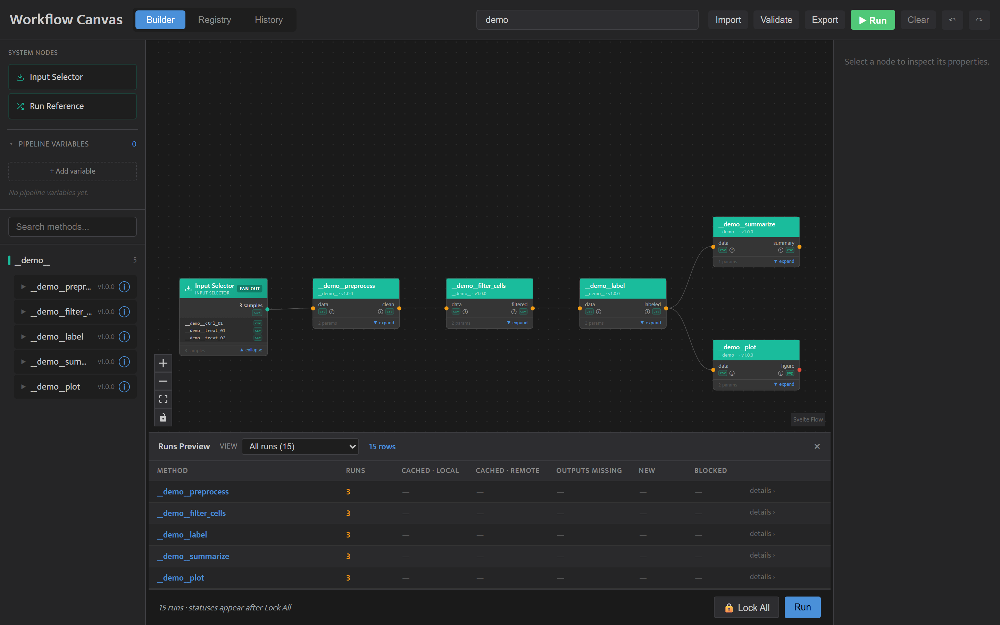

**The palette.** At the top are the two system nodes, **Input Selector** and **Run Reference** (see System Nodes below), then the Pipeline Variables panel, then every registered method grouped by module. Type in **Search methods...** to filter by method or module name. Click a method to expand its input and output slots (fan-in inputs are marked `MULTI`); the **i** button shows its description and parameters.

**Add a node.** Drag a system node or a method from the palette onto the canvas. A method node shows its input slots on the left and its output slots on the right, each labelled with its file type (`csv`, `h5ad`, `dir`, ...) and coloured by that type, so slots of the same type share a colour.

**Connect nodes.** Drag from an output slot to an input slot. An input slot takes one connection; if you drop a second one onto it, Canvas refuses it and says which slot is already connected. The one exception is Run Reference nodes: several of them can feed the same slot.

**Delete and undo.** Select a node and press Backspace, right-click it and choose **Delete Node**, or use the delete button on the node or in the Inspector. Hover over a connection to delete it. **Ctrl+Z** undoes and **Ctrl+Y** (or **Ctrl+Shift+Z**) redoes; the toolbar has matching buttons. **Clear** empties the canvas.

## System Nodes

A pipeline's data comes in through **system nodes**. Every method node needs something connected upstream of it, so each chain starts at a system node; Validate reports a method node with nothing feeding it.

**Input Selector** feeds registered samples into the pipeline. Select the node, pick samples on the **Select Inputs** tab and click **Accept Selection**. The **Settings** tab sets the node's label and whether the samples fan out (one run per sample, the default) or fan in (one run for all of them); see [Fan-out and Fan-in](#fan-out-and-fan-in) below.

**Run Reference** feeds an output of a finished run into the pipeline, so you can build on earlier results without re-running them. Select the node, choose a completed run on the **Select Run** tab (expand a run to see its parameters and outputs) and click **Accept Selected Run**. The **Output** tab sets the node's label and shows the chosen run. The quickest way to add one is **Reference in Canvas** on a run in History (see [From History Back to the Builder](#from-history-back-to-the-builder)).

## Setting Parameters

Click a method node to open it in the Inspector. The **Config** tab lists the node's inputs and outputs with what each is wired to (click a chip to jump to that node), then its parameters. Required parameters are marked `*`; hover the `?` for a parameter's description.

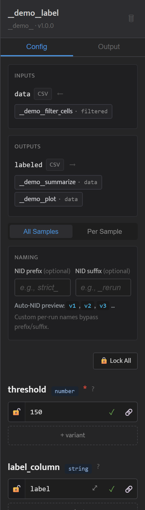

**Edit a value.** Each parameter row is locked (🔒) until you edit it. Click ✎ to unlock the row, change the value, and press Enter or click ✓ to lock it in. The control matches the parameter's type: a toggle for booleans, a dropdown for a fixed set of choices, a number box for `int` and `float`, a text box for strings (⤢ expands it to several lines), and JSON for `list` and `dict`. If the type does not accept a value, the row says why and stays unlocked. A text parameter that names a column of an upstream table offers the declared column names as suggestions.

A parameter you never set runs with the method's declared default.

**Lock All** at the top of the parameter list is enabled while the node has unlocked rows; it works like **Lock All** in the Runs Preview (see [Checking and Running a Pipeline](#checking-and-running-a-pipeline)).

To try several values for a parameter, or give one sample its own values, see [Variants and Per-Sample Values](#variants-and-per-sample-values). To share one value across many rows, see [Pipeline Variables](#pipeline-variables).

The **Output** tab shows the log of this node's most recent run. When a step fails, the Inspector shows a **This step failed** banner with a **View log** button.

## Variants and Per-Sample Values

A **sweep** runs a step several times with different values for a parameter. Each value is a **variant**, and each variant runs as its own branch, so the step and everything downstream of it run once per variant.

**Add variants.** In the node's Inspector, click **+ variant** under a parameter to add another value. If only one parameter on the node has variants, each variant keeps its own name. If several parameters have variants, the node runs every combination of them, named `v1`, `v2`, and so on; two parameters with two values each give four runs per sample.

**Name the runs.** Under **Naming**, an optional NID prefix and suffix are added to the automatic names of this node's runs. A run you rename yourself in the Runs Preview keeps your name as typed.

**Override one sample.** Open the **Per Sample** sub-tab next to **All Samples** and pick a sample. Any value you set there, including variants, applies to that sample only; every other sample keeps the values from **All Samples**. A ● marks samples and parameters that have an override, and **Clear override** removes it. The sub-tab lists the samples of the Input Selector wired into the pipeline.

The Runs Preview shows one row per sample and variant, so you can check the combinations before you run (see [Checking and Running a Pipeline](#checking-and-running-a-pipeline)).

## Fan-out and Fan-in

The **Settings** tab of an Input Selector decides how its samples flow through the pipeline.

**Fan-out (the default).** Each selected sample runs as its own branch: with four samples selected, every downstream step runs four times, once per sample. **Keep going on failure** is on by default, so one sample failing doesn't cancel the others; the node then shows a count of how many samples succeeded, such as `3/4 ✓`. Turn it off to stop the whole pipeline at the first failure.

**Fan-in.** Switch to **Fan-in** to bundle all the selected samples into a single run, for example to merge or compare them. The step the selector feeds receives every sample on one input slot and runs once, and every step downstream of it also runs once. In History, the run shows the samples it bundled.

Wire a fan-in selector straight into the step that combines the samples, and make it that step's only input. The pipeline is refused before it starts if a fan-in step also takes another input, or if a step below a fan-in step also takes per-sample outputs.

Variants and fan-out multiply: two samples fanned out into a step with three variants give six runs of that step.

## Pipeline Variables

A pipeline variable is a named value you set once and bind to parameters on several nodes, for example a label column that several methods use.

**Create a variable.** Open the **Pipeline Variables** panel in the palette (below the system nodes) and click **+ Add variable**. Enter a name, pick a type (`str`, `int`, `float`, `bool`, `list` or `dict`), enter a value and click ✓. A value the type does not accept is reported in the panel and the variable is not added. Each variable's row shows its type, its value and how many parameter rows are bound to it. Click × to delete a variable; if rows are bound to it, Canvas asks you to confirm first.

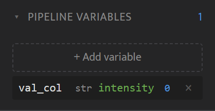

**Bind a parameter.** In the Inspector, click 🔗 on a parameter row and choose a variable. Variables of a type the parameter cannot take are greyed out. The row then shows `→ name` and the variable's value. A bound row can't also have variants or per-sample values.

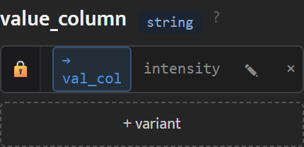

**Unbind.** Click × on a bound row to unbind it, or ✎ to unbind it and start editing a literal value straight away.

When the pipeline runs, every bound parameter receives its variable's value. The exported pipeline JSON keeps the variables and bindings (a bound parameter is written as `{"$var": "name"}`), so it runs the same way with `wfc run-pipeline`, and **Open pipeline in Canvas** in History brings them back with their bindings.

## Checking and Running a Pipeline

**Name the pipeline** in the text field in the toolbar. The name becomes the pipeline's card title in History's Pipelines view.

**Validate** checks the graph against the registered methods and lists any problems, such as an unknown method or a method node with nothing feeding it. A valid graph shows "Workflow is valid!".

**The Runs Preview** at the bottom of the Builder lists every run the pipeline will schedule. The **All runs** view has one row per method node with its run count; pick a node to see its runs, one per sample and variant, with the parameters each will use. Those rows can be grouped by sample, variant or status. A row that would produce exactly the same result as an earlier row is counted but hidden behind a **Show N reused** toggle. Close the table with × and reopen it from the **Runs Preview** tab at the bottom edge.

Until you lock, the preview shows run counts only. Click **🔒 Lock All** to lock every parameter row and ask the project which runs are already done. Each row then shows one status:

| Status | What happens on Run |
|---|---|
| `cached · local` | skipped; the earlier result is reused |
| `cached · remote` | skipped; the earlier result is pulled from the remote |
| `outputs missing` | re-run, because the earlier run's outputs are gone |
| `new · this step changed` | runs |
| `new · upstream re-runs` | runs, because a step feeding it runs |
| `blocked` | cannot run; the row gives the reason |

A cached row links to the run it reuses. Any edit clears the statuses until you lock again. While a row is blocked, **Run** is disabled and its tooltip lists the reasons. For why a step is reused or re-run, see [Caching and Reproducibility](../explanation/caching-and-reproducibility.md).

**Run** starts the pipeline. If any parameter row is still unlocked, Run first opens a summary listing those rows and every parameter that will run with its declared default; click **Lock and run** to go ahead. If a row cannot be locked, the summary names it and the run does not start.

While the pipeline runs, **Run** becomes **Stop**, and each node shows its status: running, completed, failed, cancelled, cached when its result was reused, or a count such as `3/4 ✓` when some of its samples failed. If several nodes use the same method, each one shows only its own runs. Select a node and open the Inspector's **Output** tab to follow its log. A cached node names the run it reused, and a cancelled node names the upstream step whose failure stopped it.

If a pipeline is interrupted, a badge in the toolbar counts the runs whose outputs are not yet archived; click it and choose **Archive now**.

**Import and Export.** **Export** downloads the canvas as a pipeline JSON file named after the pipeline, which you can run with `wfc run-pipeline` (see [Run and Inspect from the Command Line](run-and-inspect-results.md)). **Import** loads a pipeline JSON file and replaces the canvas; Canvas asks first if the canvas has unsaved work, and does not import while a pipeline is running.

## The History Tab

The History tab shows the project's past runs, including runs started with `wfc run-pipeline`. A summary line counts the runs by status, with cache hits also counted under cached.

**Views.** Switch between three views at the top:

- **Descendants** (the default) -- per sample, a collapsible tree of the runs that actually executed. Runs served from the cache are left out, so after a re-run the tree shows only new work. A run with several parents appears under each parent with an "N parents" marker, and selecting one copy highlights all of them. **Collapse all** and **Expand all** sit at the end of the filter bar.
- **Lineages** -- one row per chain of runs, left to right from sample to final step. Runs served from the cache carry a `⟳ CACHED` pill, so a re-run gets its own row even when every step in it was reused.
- **Pipelines** -- one card per submitted pipeline, titled with its name (or a short id if it had none), holding the runs it produced.

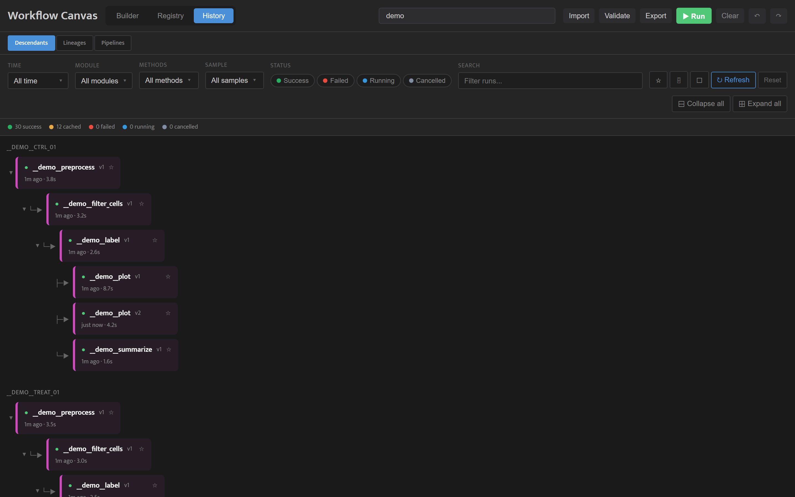

After a pipeline's first run, every step in the Lineages view has executed:

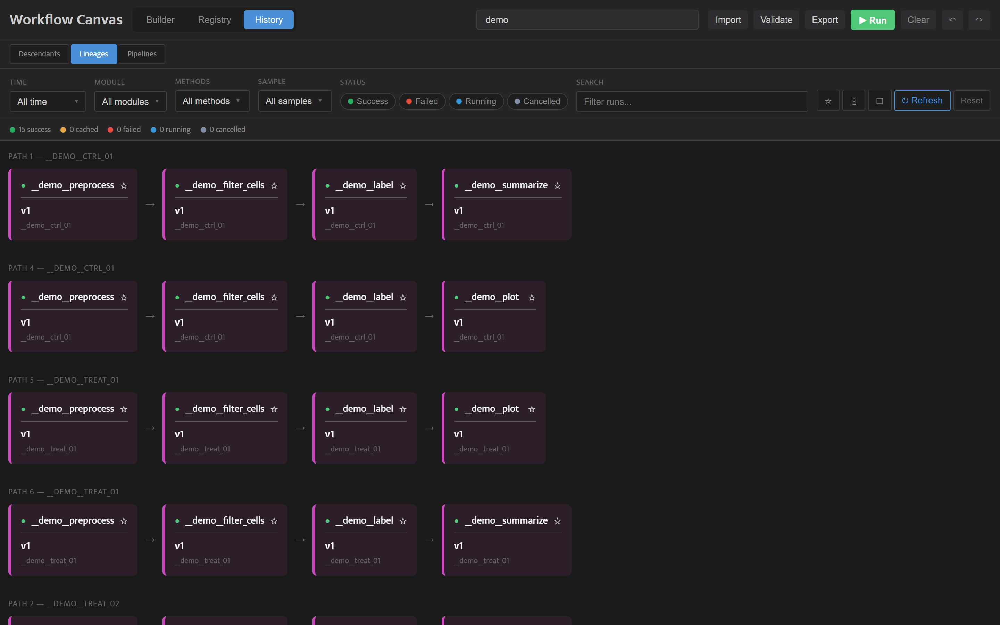

Change one parameter on the last step and run again, and only that step executes. Its new row shows the reused upstream steps marked `⟳ CACHED`, followed by the new run:

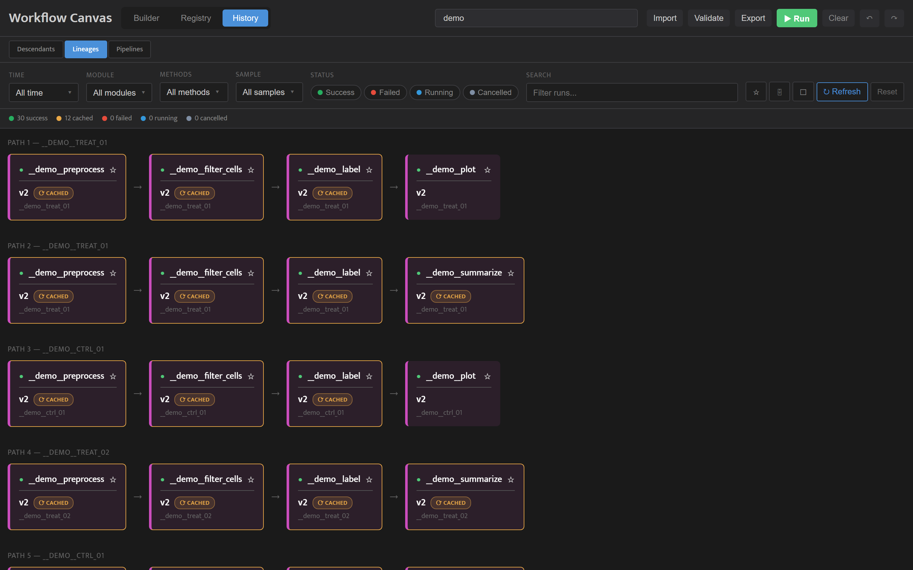

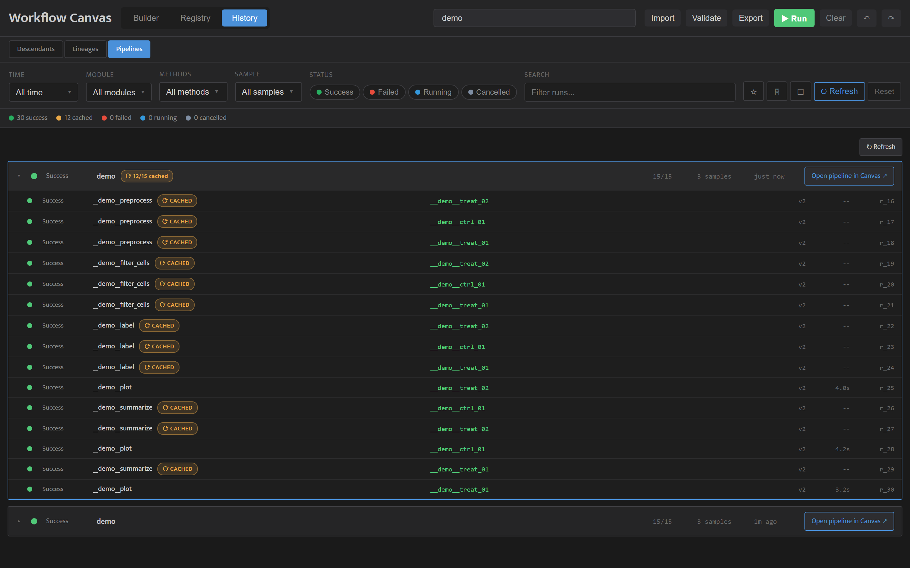

**Filters.** The filter bar applies to every view. Narrow the runs by time range (last 24 hours, 7 days or 30 days), module, methods, samples, status and free-text search. Choosing a module narrows the Methods list to its methods, and the Samples list offers only samples with matching runs. The buttons at the end of the bar show only favorites (★), show or hide archived runs (archived runs are hidden by default), turn on select mode for export, refresh, and reset the filters.

**Focus on one run.** Open a run and click **→ Descendants** in its detail panel to show only that run and the runs downstream of it; a banner names the run. **Show all runs** returns to the full view.

## Run Details and Downloads

Click a run in any view to open its detail panel. From its header you can copy the run ID (which `wfc export` takes) or a share link, download the run's record as JSON, star it as a favorite, rename it, or archive it to hide it from the default list (**Unarchive** brings it back). The panel has five tabs:

- **Overview** -- run ID, start time, the pipeline it belongs to, its parent runs by input slot, and each sample it read as a line "reads *sample* → *slot*". A cached run shows **Cached from** with a link to the run it reused. A cancelled run names the failed run that caused it, and a failed run shows its error and lists the runs cancelled because of it.
- **Parameters** -- the values it ran with.
- **Metrics** -- the numbers the method logged.
- **Artifacts** -- the output files. Click a file to download it; images show a thumbnail that opens full size. A cached run lists the outputs of the run it reused.
- **Output** -- the run's log. **Load full log** shows all of it.

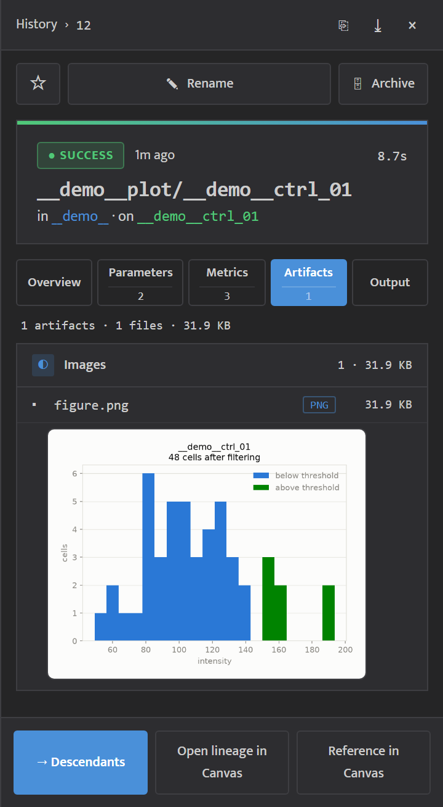

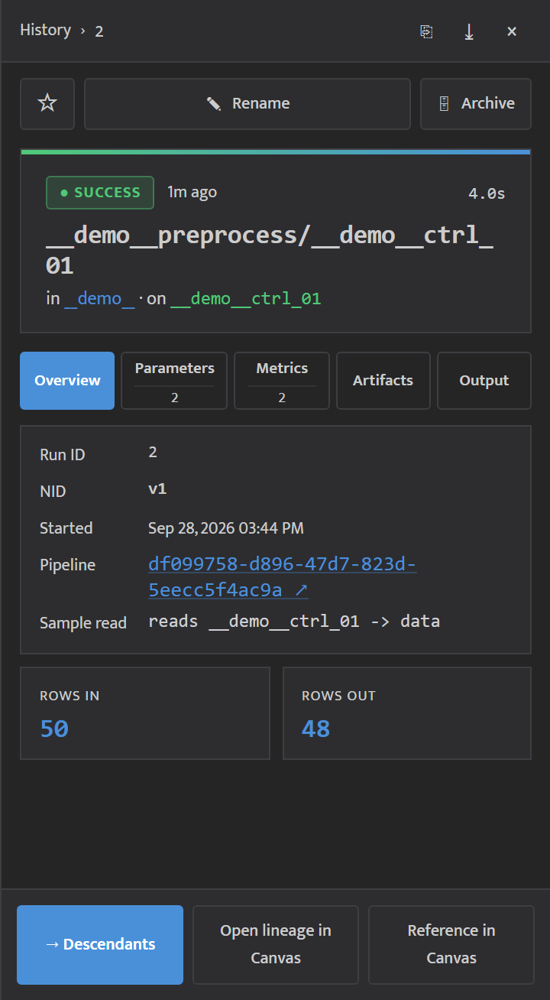

**Download several runs at once.** Click the select-mode button in the filter bar and tick the runs you want, then click **Export Artifacts** in the bar that appears. A preview shows the number of runs, files and methods, the total size and a breakdown by file type. Click **Download Zip** to download them as one zip file.

## From History Back to the Builder

Three actions load History into the Builder:

- **Open pipeline in Canvas ↗** on a Pipelines card loads the pipeline as it was submitted, including its pipeline variables and bindings.
- **Open lineage in Canvas** in the detail panel rebuilds the run and every run upstream of it as a pipeline, each connection using the output and input slot the run actually used. Run it as-is to reuse its results, or change a parameter and run it as a new pipeline.
- **Reference in Canvas** in the detail panel adds a Run Reference node for the run to the current canvas and keeps everything already there, so a new pipeline can use its outputs as input. A message with **Jump to node** shows where it landed.

Both Open actions replace the canvas. Canvas asks first if the canvas has unsaved work, and does not replace it while a pipeline is running.

## The Registry Tab

The Registry tab lists everything registered in the project, on four sub-tabs.

- **Modules** -- each module with its output contracts and an `N methods →` link to its methods.
- **Methods** -- expand a method to see its inputs, outputs and parameters, and every file in the method's directory with syntax highlighting. **check** validates the method against its current code and shows the error if it fails.
- **Envs** -- each registered environment with its backend, the methods that use it and its run count. Expand a pixi or conda environment to see its installed packages as `name==version`, tagged conda, pixi or pip.
- **Samples** -- each sample with its size, whether it has been pushed to the remote or is local-only, and how many runs used it.

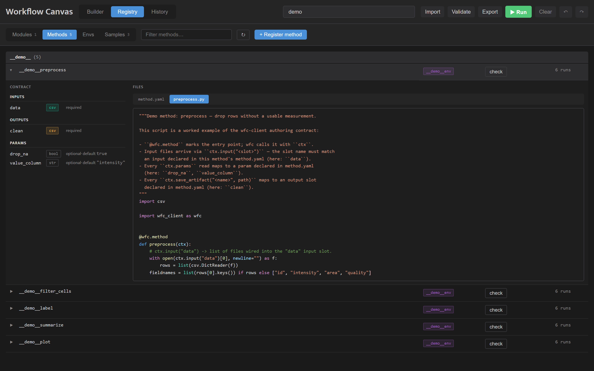

On the Modules, Methods and Samples sub-tabs, **+ Register** opens a form to register a new one from the browser; see [Registering Modules, Methods, and Samples](registration.md). Environments are registered from the command line; see [Registering an Environment](../tutorials/registering-an-environment.md).

## Next Steps

- [Run and Inspect from the Command Line](run-and-inspect-results.md) -- run an exported pipeline with `wfc run-pipeline` and copy outputs out with `wfc export`.
- [Caching and Reproducibility](../explanation/caching-and-reproducibility.md) -- why a step is reused or re-run.
- [Storage and Provenance](../explanation/storage-and-provenance.md) -- where outputs are stored.
- [CLI Reference](../reference/cli-reference.md) -- every `wfc` command, including `wfc canvas`.
