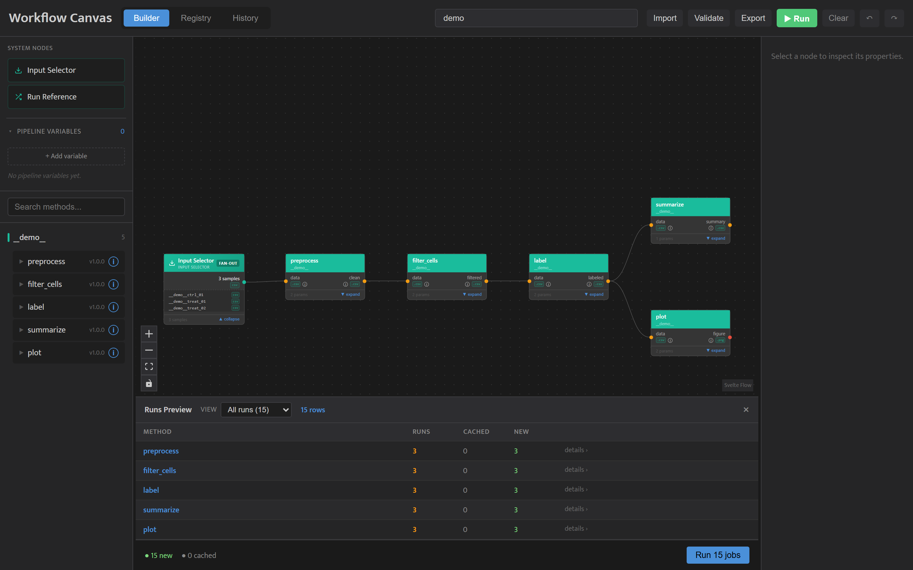
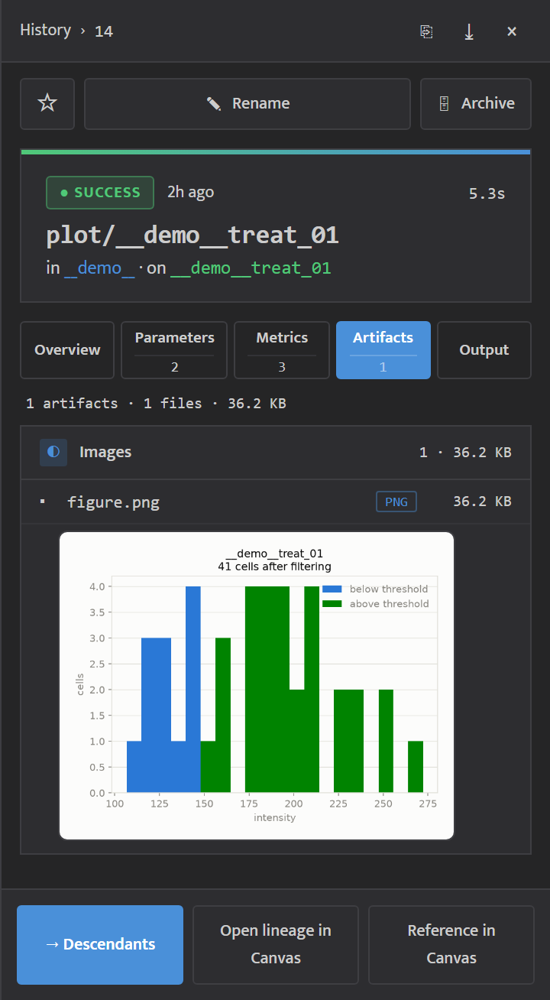

<!-- generated from pm_mvp::docs.consumer.tutorials.wfc-demo @ 4724dc19a4c2; do not edit -->

# Tutorial: Exploring the Demo

## What `wfc demo` does

`wfc demo` populates an already-initialised project with a complete, runnable pipeline in one command — no methods, environments, or sample data to author yourself. It's the fastest way to see a real Workflow Canvas run end to end.

```bash
wfc init
wfc demo
```

`wfc demo` requires `wfc init` first. It builds a small container environment, registers five methods and three samples through the genuine registration path (the same code path your own methods go through — no shortcuts), writes a pipeline file, and opens the Canvas with that pipeline already wired. Pressing **Run** executes all five steps for all three samples.



If the directory isn't an initialised project, `wfc demo` exits non-zero and creates nothing. If Docker is unavailable, it exits non-zero having changed nothing. If a demo is already present, it exits non-zero and points you at `--force` (replace it) or `--remove` (tear it down).

## The Pipeline

The demo pipeline has five methods over three samples (`ctrl_01`, `treat_01`, `treat_02` — 50 rows each, one row per cell):

```
preprocess -> filter_cells -> label -> summarize
                                    -> plot
```

- **preprocess** drops rows with a missing `intensity` measurement (`drop_na=true`).
- **filter_cells** keeps rows with `quality >= min_quality` (default `0.5`).
- **label** writes `"above"` or `"below"` depending on whether `intensity >= threshold` (default `150`).
- **summarize** groups the labeled rows and reports per-group counts and mean intensity.
- **plot** renders a per-sample intensity histogram, colored by the label column — this is the run's visible payoff.

Each demo method script carries comments mapping its code to its `method.yaml` contract (each `ctx.save_artifact` to its declared output slot, each `ctx.params` read to its declared param, each input to its `ctx.input()` slot) — they're written to be copied as a starting point for your own methods. See [Authoring a Method Script](authoring-a-method-script.md) for the general pattern.

## Inspecting a Run

Open a completed `plot` run in the History tab's detail panel. Its PNG figure renders as an inline thumbnail on a light card — click it for a full-size lightbox (Escape or click-outside closes it). See [Run & Inspect Results](../how-to/run-and-inspect-results.md) for the rest of the Artifacts tab.



To pull any intermediate CSV out of the cache for your own inspection:

```bash
wfc export <run-id> <output-name> <dest>
```

See [Exporting a run's outputs](../how-to/run-and-inspect-results.md#exporting-a-runs-outputs) for the full command.

## The Sample Data

All three CSVs share the same schema: `id` (`cell_001` … `cell_050`), `intensity` (float; 1-2 cells per file are blank — this is what `preprocess`'s `drop_na` exercises), `area` (float, always present, unused by the shipped params), and `quality` (float 0-1, always present — the `filter_cells` gate).

| Sample | intensity range | empty `intensity` cells | quality range |
|---|---|---|---|
| `ctrl_01` | 49.2 – 193.5 | 2 | 0.51 – 0.98 |
| `treat_01` | 70.3 – 272.2 | 1 | 0.31 – 0.95 |
| `treat_02` | 80.0 – 320.7 | 2 | 0.21 – 0.80 |

The default `min_quality=0.5` sits inside every sample's quality range but bites differently — `ctrl_01` loses nothing (its minimum is 0.51), `treat_01` keeps 41 of 49 rows, `treat_02` keeps 28 of 48 (its low-quality tail is deliberately heavy). The default `threshold=150` also sits inside all three intensity ranges and separates the two conditions: after filtering, `ctrl_01` is 7 above / 41 below, `treat_01` is 29 above / 12 below, `treat_02` is 23 above / 5 below — control mostly below, treated mostly above.

Retuning `threshold` in the Canvas visibly moves the above/below split (e.g. `200` puts almost all of `ctrl_01` below); retuning `min_quality` mainly changes `treat_02`'s row count.

## Removing the Demo

```bash
wfc demo --remove
```

This removes exactly what `wfc demo` added — the demo's module, methods, samples, environment, runs (with their input/output/annotation rows), copied method directories, restored sample files, the pipeline file, and the built image's Dockerfile — and nothing you registered yourself, even a method of yours that happens to share a demo method's name (e.g. `preprocess`). It prints what it's about to remove (including the run count) and asks for confirmation unless you pass `--yes`. Removal is idempotent and tolerates a partially-scaffolded demo. Cached output bytes are untouched — `wfc cache prune` reclaims those separately.

The `__demo__` name prefix is reserved: `wfc register-module`, `register-method`, `register-sample`, and `register-env` (and the Canvas Registry tab) all refuse a name starting with `__demo__`, so nothing you register can collide with or be swept up by `wfc demo --remove`.

## Next Steps

Ready to build your own pipeline? Start with [Getting Started](getting-started.md) or go straight to [Authoring a Method Script](authoring-a-method-script.md) — the demo's own method scripts (`wfc/demo/assets/methods/` in the installed package) are a second worked example alongside that tutorial.
